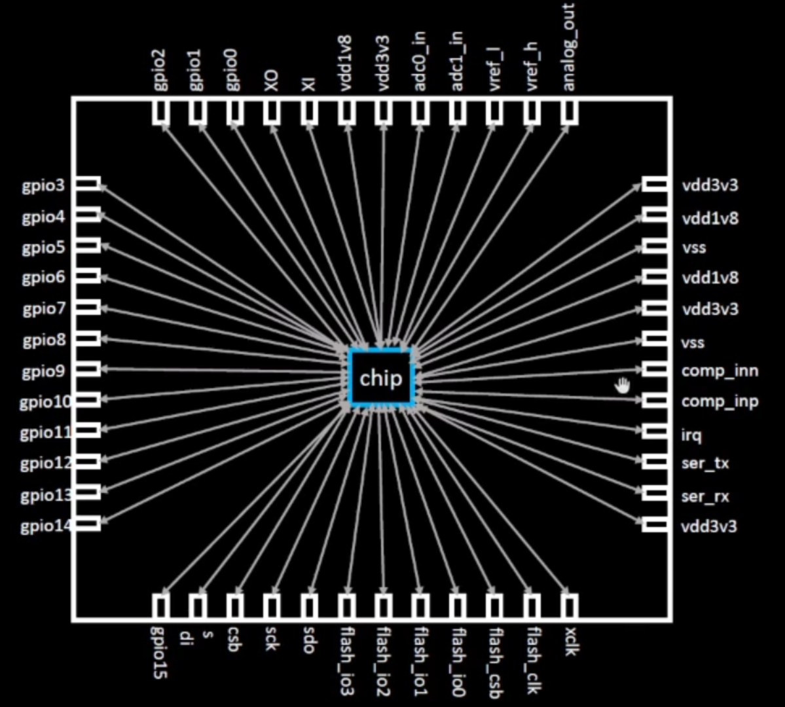
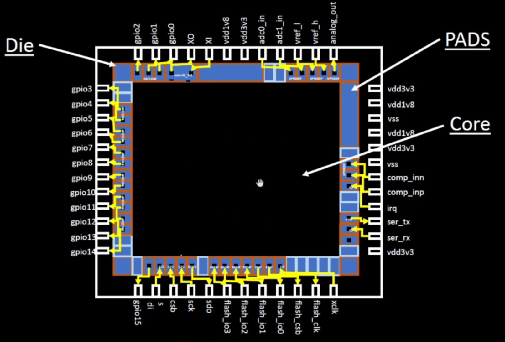
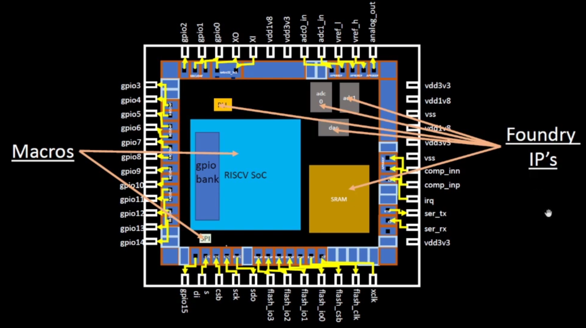
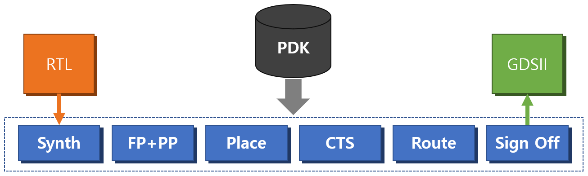

# Advanced OpenLANE Workshop

### Prerequisites

  1. Ubuntu OS-based System
  2. 25GB+ Disk Space

### Installation

1. Clone below website on Ubuntu OS (VirtualBox or native env)

   a. https://github.com/nickson-jose/openlane_build_script
   b. https://github.com/kunalg123/vsdflow

2. Just Follow 1.a. . Don't doubt Just follow 1.a.
   1. build
   2. run

Install need a lot of time. So if you don't follow the direction, you will be lost huge time. like me...

## Content

---

### Day1. Inception of open-source EDA, OpenLANE and Sky130 PDK

   - How to talk to computer?
     - QFN-48 (Quad Flat No-leads 48) is IC package name
       - IC package type (check below link)
         - https://www.electronicsforu.com/resources/dip-smd-qfp-bga-ic-packages
     - chip, pads, core, die and IPs
       - you can find what is chip, pads, core, die, IPs, macro in below picture





   - ISA : Instruction Set Architecture
     
     - ISA have two type
       - CISC(Complext Instruction Set Computer) (ex. x86, x86_64)
       - RISC(Reduced Instruction Set Computer) (ex. MIPS, ARM, RISC-V)
   
   - SW-to-HW
     - (C, C++, others) => [Compiler] => (Instruction) => [Assembler] => (Binary File) => [Hardware]
  
   - SoC design and OpenLANE
     - For ASIC, we need three component
       - RTL Designs : we can find a lot of RTL Design in librecores, opencores, github
       - EDA Tools : Qflow, OpenROAD, OpenLANE
       - PDK Data : What is PDK?
         - PDK(Process Design Kit)
         - Collection of files used to model a fabrication process for the EDA tools used to design an IC
         - PDK info is below.
           - Process Design Rules : DRC, LVS, PEX
             - DRC(Design Rule Check)
             - LVS(Layout Versus Schematic)
             - PEX(Parasitic Extraction)
           - Device Models
           - Digital Standard Cell Libraries
           - I/O Libraries
     - In this project, we use OpenSource PDK which is SkyWater-pdk 130nm

   - Simplified RTL to GDSII Flow


      - **Synth** = Synthesis : Convert RTL to circuit based on Standard Cell Library(SCL)
        - **Standard Cell** have regular layout. **Same height, diff width**
      - **FP+PP = Floor Planning & Power Planning** : 
        - **Floor planning** : Partition the chip die between different system building blocks and place the I/O Pads
        - **Power Planning** : Setting multiple VDD and GND
      - **Place** : Place the cells on the floorplan rows, aligned with the sites. it have two step. Global and Detailed
      - **CTS = Clock Tree Synthesis** : Create a clock distribution Network
        - To deliver the clock to all sequential elements(ex. FF)
        - with minimum skew (zero is hard to achieve)
        - Usually a Tree (H, X, ...) 
      - **Route** : Implement the interconnect using the available metal layers
        - Metal tracks from a routing grid
        - Routing grid i huge
        - Divide and Conquer
          - Global Routing : Generated routing guides
          - Deailed Routing : Uses the routing guides to implement the actual wiring
      - **Sign off**
        - Physical Verification
          - Design Rules Checking(DRC)
          - Layout vs. Schematic(LVS)
        - Timing Verification
          - Static Timing Analysis(STA)


   - OpenLANE
     - OpenSource ASIC design Flow
     - Main Goal : Produce a clean GDSII with no human intervention(no-human-in-the-loop)
     - Clean means
       - No LVS Violations
       - No DRC Violations
       - Timing Violations? Work In Progress!
     - OpenLane Flow

     - OpenLane Link : https://github.com/efabless/openlane 


     - Lab1. How to Synthesis?
       - go to openlane position (ex. (my_path)/work/tools/openlane_working_dir/openlane/)
       - make your design folder in design folder
          - ex) (my_path)/work/tools/openlane_working_dir/openlane/designs/(your_prj_folder)
       - ./flow.tcl -interactive
          ```openlean
          package require openlane 0.9
          prep -design (your_prj_folder) -tag (result_folder_name)
          run_synthesis
          ```

### Day2. Understand importance of good floorplan vs bad floorplan and introduction to library cells

   - chip Floor planning considerations
   - Library Binding and Placement
   - Cell design and characterization flows
   - General timing Characterization parameters

### Day3. Design and characterize on library cell using Magic Layout tool and ngspice

   - Labs for CMOS inverter ngspice simulations
   - Inception of Layout - CMOS fabrication process
   - Sky130 Tech File Labs

### Day4. Pre-layout timing analysis and importance of good clock tree
   
   - Timing modeling using delay tables
   - Timing analysis with ideal clocks using openSTA
   - Clock tree synthesis TritonCTS and signal integrity
   - Timing analysis with real clock using openSTA

### Day5. Fianl steps for RTL2GDS

   - Routing and design rule check(DRC)
   - PNR interactive flow tutorial

   
