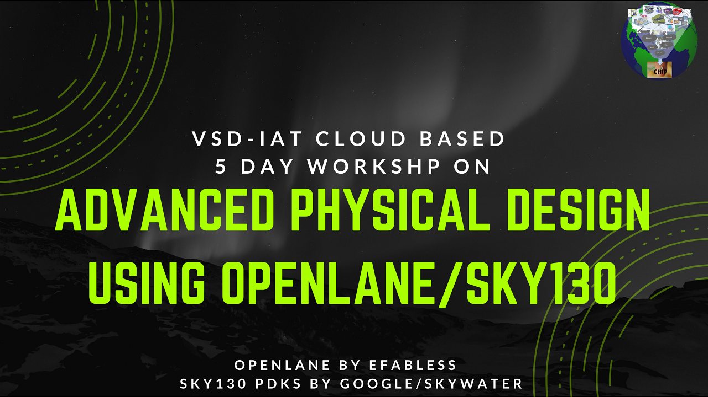

# Advanced OpenLANE Workshop

### Prerequisites

  1. Ubuntu OS-based System
  2. 25GB+ Disk Space

### Installation

1. Clone below website on Ubuntu OS (VirtualBox or native env)

   a. https://github.com/nickson-jose/openlane_build_script
   b. https://github.com/kunalg123/vsdflow

2. Just Follow 1.a. . Don't doubt Just follow 1.a.
   1. build
   2. run

Install need a lot of time. So if you don't follow the direction, you will be lost huge time. like me...

## Content

### Day1. Inception of open-source EDA, OpenLANE and Sky130 PDK

   - How to talk to computer?
   - SoC design and OpenLANE
   - Starting RISC-V SoC Reference design
   - Get familiar to open-source EDA tools

### Day2. Understand importance of good floorplan vs bad floorplan and introduction to library cells

   - chip Floor planning considerations
   - Library Binding and Placement
   - Cell design and characterization flows
   - General timing Characterization parameters

### Day3. Design and characterize on library cell using Magic Layout tool and ngspice

   - Labs for CMOS inverter ngspice simulations
   - Inception of Layout - CMOS fabrication process
   - Sky130 Tech File Labs

### Day4. Pre-layout timing analysis and importance of good clock tree
   
   - Timing modeling using delay tables
   - Timing analysis with ideal clocks using openSTA
   - Clock tree synthesis TritonCTS and signal integrity
   - Timing analysis with real clock using openSTA

### Day5. Fianl steps for RTL2GDS

   - Routing and design rule check(DRC)
   - PNR interactive flow tutorial

   
